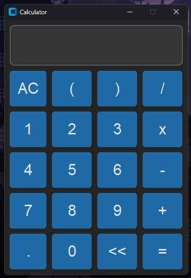
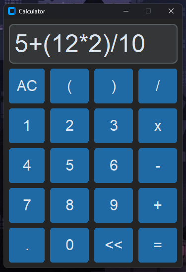
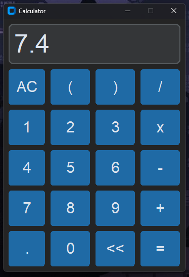
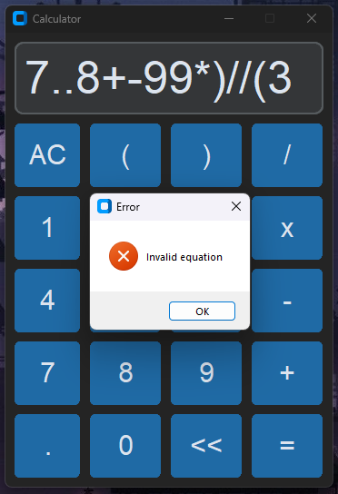
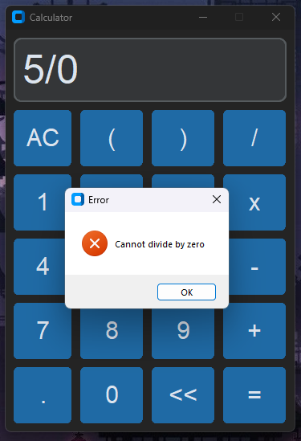

# python-calculator
A simple calculator with a **modern UI** created using python on VS Code.

## Imported Modules
* **CustomTkinter :** A custom GUI toolkit which can be installed using the following command:
```
pip install customtkinter
```
* **Tkinter :** A standard GUI tooklit which comes intalled with Python.

## Features
* Modern UI
* Takes float values
* Equation creation
* Arithmetic Operations:
    * Addition (+)
    * Subtraction (-)
    * Multiplication (*)
    * Division (/)
* Other Operations:
    * Clear Button (AC)
    * Backspace Button (<<)
    * Decimal Button (.)
    * Equals Button (=)
    * Open Bracket Button ("(")
    * Close Bracket Button (")")

## Screenshots
### Calculator:


### Can input equations:


### Solution of the above equation:


### When an invalid equation is passed:


### When divided by zero:
